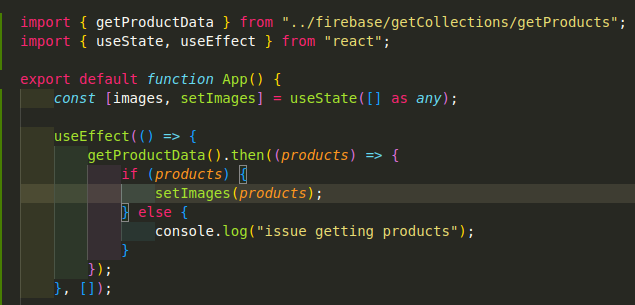

## Retrieving Products

1. import `getProductData` from `getProducts.tsx`
2. import `useState` and `useEffect`
3. retrieve products like below inside the use effect hook so they are only retrieved on first load of the page
   

4. Map the images with whatever detail you need, i.e.
   
